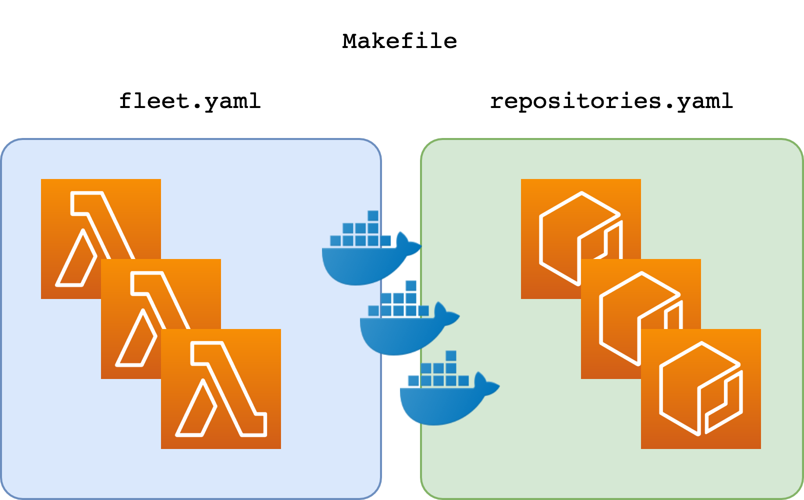

## Container-Lambda fleet

A boilerplate to deploy a fleet of microservices based on Lambda-ContainerBased-Golang function. Some more comments on this repo [in my blog post](https://madeddu.xyz/posts/aws/container-lambda-fleet). For more information about this new functionality, have a look [here](https://aws.amazon.com/blogs/aws/new-for-aws-lambda-container-image-support/) - the AWS Blog Post.

### How it works

The big picture is simple and it's shown in this diagram below:



The template file named `repositories.yaml` is in charge of microservices-repository-deployments.

The template file named `fleet.yaml` is in charge of microservices-fleet-deployments.

### Requirements

A working AWS account with a profile configured, sam cli latest version, a cloudformation console opened (just in case)

### How it works

In simple three steps:

1) Clone the repo by running:
```
git clone https://github.com/made2591/container-lambda-fleet.git
container-lambda-fleet
```

2) Change your profile name by running:
```
vi Makefile
```

3) From the root of the repo just run:
```
make create-everything
```

Done.

Have fun 😎😎😎!! 

### Thanks to

Many thanks to aws sam team to provide some boilerplate for the supported language inside Lambda and having a cli ready to deploy with new container image :)